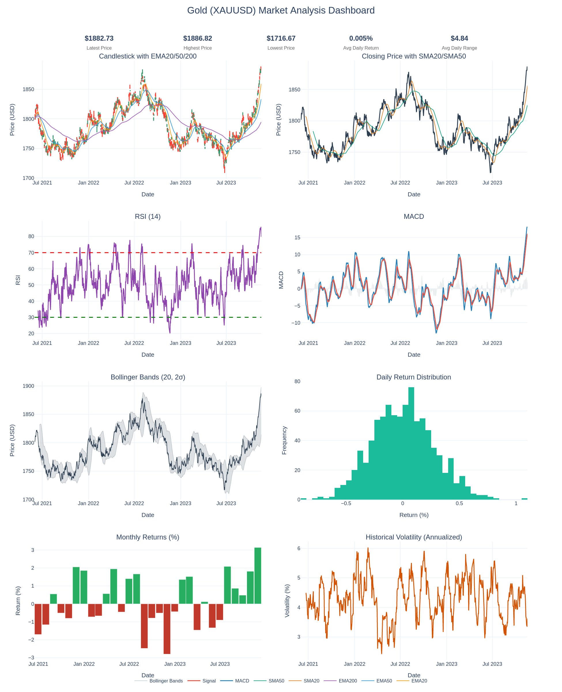
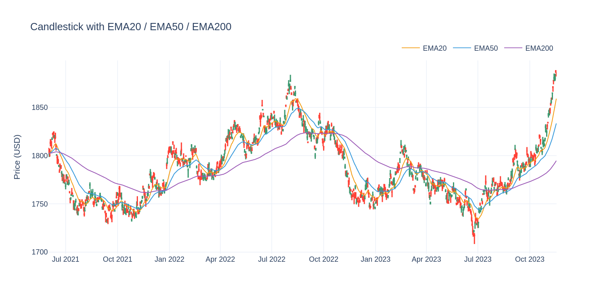
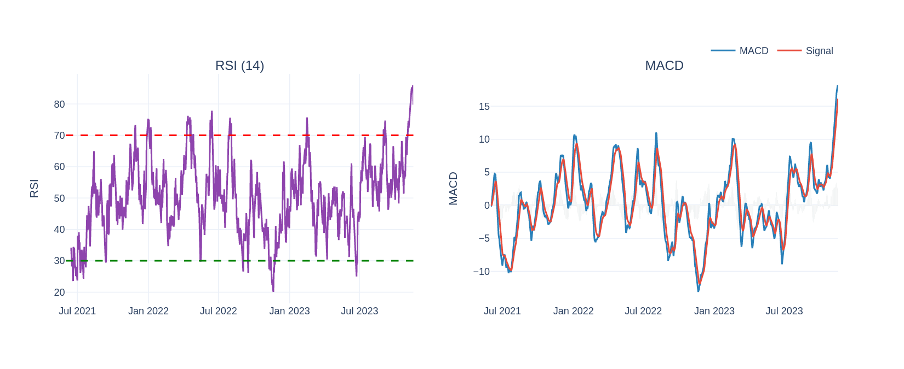

# Gold (XAUUSD) Market Analysis Dashboard


A data analysis portfolio project that downloads, cleans, and analyzes historical
Gold (XAUUSD) market data, calculates technical indicators, performs statistical
and seasonality analysis, and presents the results through an interactive Plotly
dashboard and an automated market report.

> **This is a data analysis project** — not a trading bot, not a signal generator,
> and not a machine learning / prediction system. It exists to demonstrate practical
> data collection, cleaning, feature engineering, statistics, and visualization skills.

---

## Project Overview

The pipeline moves through five stages, each with a matching script and notebook:

1. **Data Collection** — download historical XAUUSD OHLCV data from Yahoo Finance
2. **Data Cleaning** — deduplicate, handle missing values, validate, and sort the data
3. **Feature Engineering** — calculate 20+ technical indicators (trend, momentum, volatility)
4. **Exploratory Data Analysis** — return statistics, seasonality, and distribution analysis
5. **Dashboard & Reporting** — an interactive Plotly dashboard, an automated text report, and an Excel summary workbook

The whole thing can also be run end-to-end with a single command via `run_pipeline.py`.

---

## Features

- Automated data download with configurable date range and interval, with retry-on-failure
- Robust cleaning pipeline (duplicates, missing values, date parsing, validation)
- 20+ technical indicators: SMA/EMA, RSI, MACD, ATR, Bollinger Bands, ADX, SuperTrend, and more
- Statistical analysis: mean/median/std/variance/skewness/kurtosis of returns
- Seasonality analysis: average return by year, month, and weekday
- Interactive Plotly dashboard with KPI cards and 8 linked charts
- Automated plain-text market report summarizing trend, volatility, and notable moves
- Multi-sheet Excel summary workbook for non-technical stakeholders
- One-command pipeline orchestrator with structured logging
- Centralized configuration (`scripts/config.py`) — no magic numbers scattered across files
- Automated test suite (pytest) and GitHub Actions CI
- Modular, type-hinted, documented, and independently runnable scripts

---

## Technologies

| Purpose | Library |
|---|---|
| Data manipulation | `pandas`, `numpy` |
| Data download | `yfinance` |
| Visualization (interactive) | `plotly`, `kaleido` (static export) |
| Visualization (static) | `matplotlib` |
| Statistics | `scipy` |
| Notebooks | `jupyter` |
| Spreadsheet export | `openpyxl` |
| Testing | `pytest` |
| CI | GitHub Actions |

---

## Folder Structure

```
gold-market-analysis/
├── .github/
│   └── workflows/
│       └── ci.yml               # GitHub Actions: lint + test on every push/PR
├── data/
│   ├── raw/                     # Raw downloaded CSV data
│   └── processed/                # Cleaned and feature-enriched CSV data
├── notebooks/
│   ├── 01_data_collection.ipynb
│   ├── 02_data_cleaning.ipynb
│   ├── 03_feature_engineering.ipynb
│   ├── 04_eda.ipynb
│   └── 05_dashboard.ipynb
├── scripts/
│   ├── config.py                # Centralized paths, ticker, and indicator windows
│   ├── fetch_data.py            # Download historical XAUUSD data (with retries)
│   ├── clean_data.py            # Clean and validate raw data
│   ├── indicators.py            # Calculate technical indicators
│   ├── analysis.py              # Statistical and time-based analysis
│   ├── dashboard.py             # Build the interactive Plotly dashboard
│   ├── generate_report.py       # Generate the automated text report
│   ├── export_excel.py          # Export a multi-sheet Excel summary workbook
│   └── run_pipeline.py          # Run the entire pipeline end-to-end
├── tests/
│   ├── conftest.py              # Shared pytest fixtures (synthetic OHLCV data)
│   ├── test_clean_data.py
│   ├── test_indicators.py
│   ├── test_analysis.py
│   └── test_generate_report.py
├── images/                      # Dashboard screenshots
├── reports/                     # Generated reports, dashboard HTML, Excel workbook
├── requirements.txt
├── pytest.ini
├── LICENSE
├── .gitignore
└── README.md
```

---

## Installation

```bash
# Clone the repository
git clone https://github.com/<your-username>/gold-market-analysis.git
cd gold-market-analysis

# Create and activate a virtual environment (recommended)
python -m venv venv
source venv/bin/activate      # Windows: venv\Scripts\activate

# Install dependencies
pip install -r requirements.txt
```

---

## Usage

### Option A — Run the entire pipeline in one command

```bash
python scripts/run_pipeline.py
```

This fetches, cleans, engineers features, analyzes, builds the dashboard, and
generates the report — logging progress at each step. Custom date range:

```bash
python scripts/run_pipeline.py --start 2015-01-01 --end 2025-01-01 --interval 1d
```

Reuse previously downloaded raw data instead of re-fetching:

```bash
python scripts/run_pipeline.py --skip-fetch
```

### Option B — Run each stage individually

```bash
# 1. Download raw data (default: last 10 years, daily interval)
python scripts/fetch_data.py

# 2. Clean the data
python scripts/clean_data.py

# 3. Calculate technical indicators
python scripts/indicators.py

# 4. Print statistical analysis to the console
python scripts/analysis.py

# 5. Build the interactive dashboard (saved to reports/dashboard.html)
python scripts/dashboard.py

# 6. Generate the automated market report (saved to reports/)
python scripts/generate_report.py

# 7. Export an Excel summary workbook (saved to reports/)
python scripts/export_excel.py
```

### Option C — Run the notebooks

Open the notebooks in order inside `notebooks/`, from `01_data_collection.ipynb`
through `05_dashboard.ipynb`. Each notebook is a thin, exploratory wrapper around
the corresponding script and shows intermediate outputs, tables, and charts.

```bash
jupyter notebook notebooks/
```

---

## Testing

The project ships with a pytest suite covering the cleaning pipeline, every
technical indicator, the statistical analysis functions, and report generation,
all run against a deterministic synthetic OHLCV fixture (no network access
required).

```bash
pytest tests/ -v
```

CI runs this same suite automatically on every push and pull request against
Python 3.11 and 3.12 (see `.github/workflows/ci.yml`).

---

## Dashboard Screenshots

**Full dashboard** — KPI cards plus all 8 linked charts:



**Candlestick with EMA20/50/200:**



**RSI and MACD:**



---

## Future Improvements

- Add correlation analysis against other assets (DXY, USD real yields, S&P 500)
- Add a scheduled GitHub Action to refresh `data/raw/` and `reports/` periodically
- Add a lightweight Streamlit or Dash front end for the dashboard (optional, out of current scope)
- Add data schema validation (e.g. `pandera`) for stronger guarantees on raw input
- Add type-checking to CI (`mypy`)

---

## Disclaimer

This project is built for educational and portfolio purposes only. It does not
constitute financial advice, and none of its outputs should be used to make
investment decisions.
